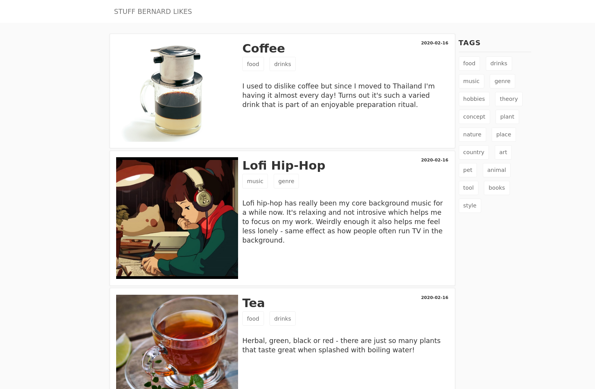

# WIL

"What I Like" is a tag-driven static website generator for creating list website of stuff you like.



Live example can be found: TODO


## Installing

Clone repository and install `pelican`:

```shell script
$ git clone https://github.com/Granitosaurus/wil
$ pip install pelican[markdown]
$ cd wil
```

Then create markdown files in `content` directory following this template:

```markdown
Title: Example Title
Date: 2020-02-01
Tags: pet,animal,nature
Summary: Short summary of the subject 
Thumb: chicken.jpg

long blog body that can include anything you want as long as it's markdown or html.
```

see `me` branch for real life examples.
